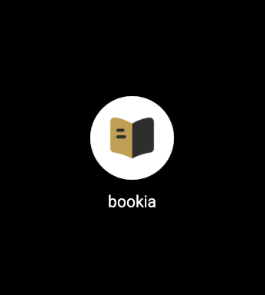
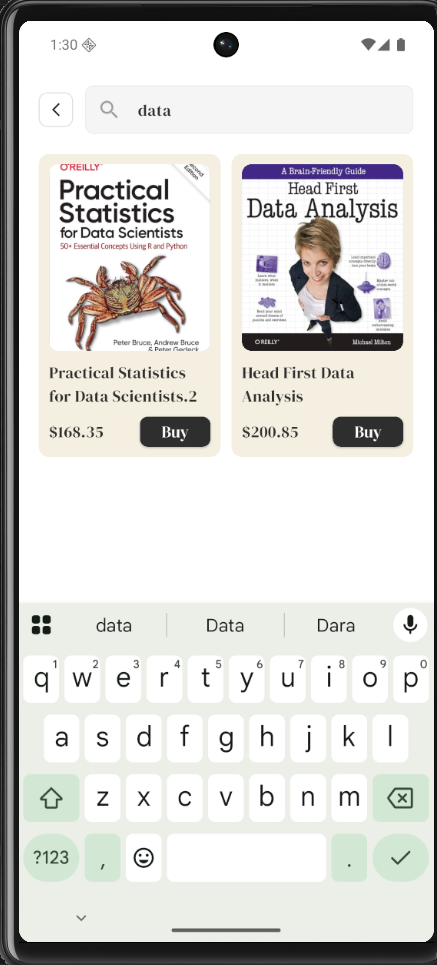
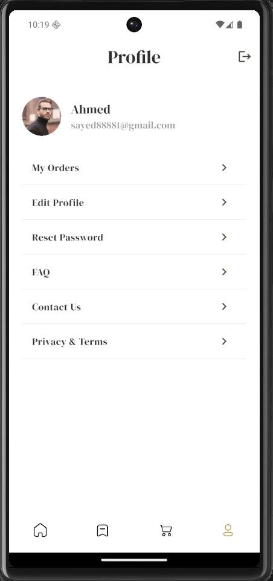
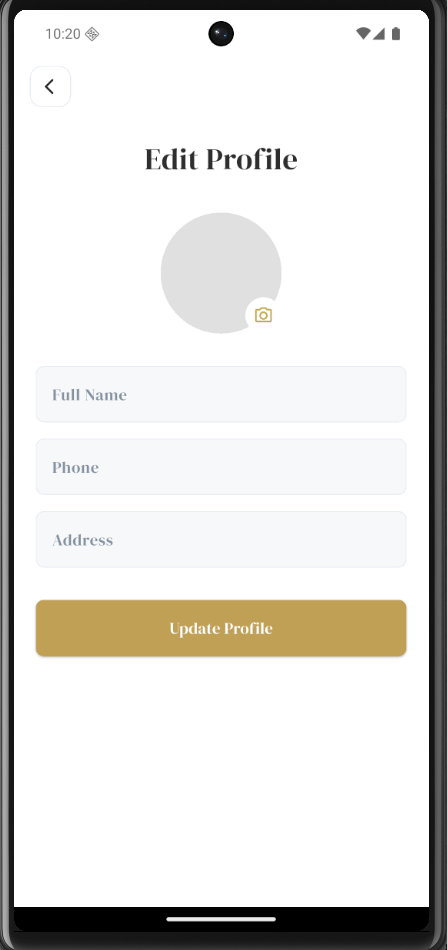
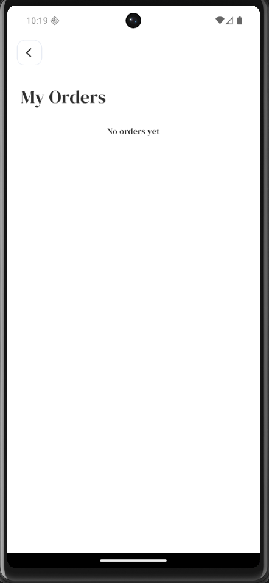
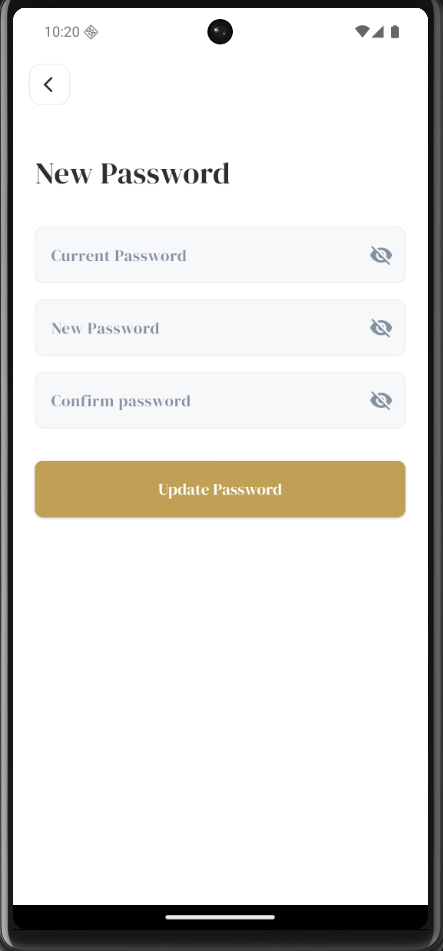
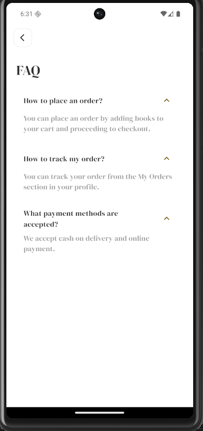
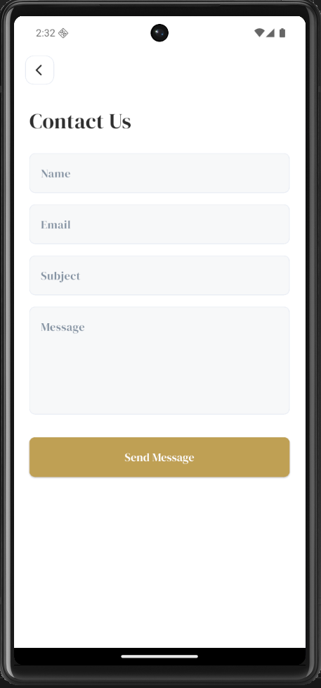

# 📚 Bookia — Online Book Store App

> A modern Flutter e-commerce experience crafted for seamless book discovery and purchasing 📖✨

---

## 🎯 App Preview

### 🧩 App Identity

|                    App Icon                   |
| :-------------------------------------------: |
|  |

---

## 🚀 User Journey

### 👋 First Impression (Onboarding)

|                  Welcome Screen                  |                  Splash Screen                  |
| :----------------------------------------------: | :---------------------------------------------: |
|  |  |

💡 *Smooth entry experience that introduces the app with clean visuals and fast loading.*

---

### 🔐 Authentication Flow

|                      Login                     |                      Register                     |               OTP Verification               |
| :--------------------------------------------: | :-----------------------------------------------: | :------------------------------------------: |
|  |  |  |

💡 *Secure and user-friendly authentication with OTP verification.*

---

### 🔑 Account Recovery

|                 Forgot Password                 |                 Create New Password                 |                Password Changed               |
| :---------------------------------------------: | :-------------------------------------------------: | :-------------------------------------------: |
|  |  |  |

💡 *Simple recovery flow to ensure users never lose access.*

---

### 🏠 Explore & Discover

|                  Home Screen                  |                      Search                     |
| :-------------------------------------------: | :---------------------------------------------: |
|  |  |

💡 *Browse books effortlessly with smart search and clean UI.*

---

### 📖 Book Details

|                      Book Details                     |
| :---------------------------------------------------: |
|  |

💡 *Detailed view with all the information users need before purchasing.*

---

### 🛒 Shopping Experience

|                      Cart                     |                      Place Order                     |                   Order Success                  |
| :-------------------------------------------: | :--------------------------------------------------: | :----------------------------------------------: |
|  |  |  |

💡 *Smooth checkout experience from cart to order confirmation.*

---

### ❤️ User Profile & Personalization

|                      Profile                     |                     Edit Profile                     |                     My Orders                     |                      Wishlist                     |                    Reset Password                    |
| :----------------------------------------------: | :--------------------------------------------------: | :-----------------------------------------------: | :-----------------------------------------------: | :--------------------------------------------------: |
|  |  |  |  |  |

💡 *Users can manage their data, track orders, and save favorites.*

---

### ℹ️ Help & Support

|                      FAQ                     |                     Contact Us                     |
| :------------------------------------------: | :------------------------------------------------: |
|  |  |

💡 *Support system to enhance user trust and experience.*

---

## ✨ Key Features

* 🔐 Secure Authentication System
* 🔎 Smart Book Search
* 🛒 Shopping Cart & Order Management
* ❤️ Wishlist System
* 👤 User Profile Management
* 🔔 OTP Verification & Password Recovery
* 📱 Clean UI & Smooth UX

---

## 🛠 Tech Stack

* **Flutter** — Cross-platform development
* **Dart** — Programming language
* **Bloc / Cubit** — State management
* **Clean Architecture** — Scalable structure
* **Dio** — API handling
* **Shared Preferences** — Local storage

---

## 📂 Project Structure

```
lib/
 ├── core/
 ├── features/
 └── main.dart
```

---

## 🚀 Getting Started

### Prerequisites

* Flutter SDK
* Dart SDK
* VS Code / Android Studio
* Emulator or Physical Device

---

## ⭐ Support

If you like this project, don’t forget to give it a star ⭐ on GitHub!
